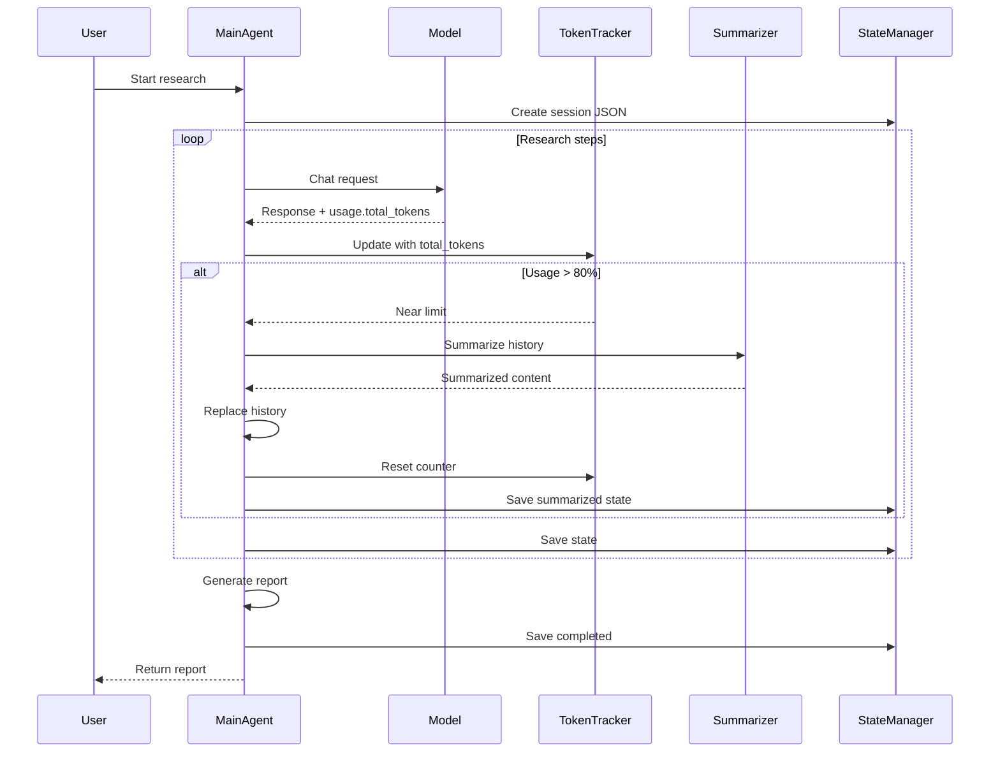

# Simplified Multi-Agent Research System v3 - Usage Guide

## Quick Start

### 1. Setup

```bash
# Install dependencies
pip install -r requirements.txt

# Configure environment
cp .env.example .env
# Edit .env with your API keys
```

### 2. Configure API Keys

Edit the `.env` file:

```env
# Brave Search API (Primary search provider)
BRAVE_API_KEY=your_brave_api_key

# Model Configuration
MODEL_BASE_URL=http://localhost:8016/v1
MODEL_NAME=your_model_name

# Token Configuration
MAX_TOKENS=8192
```

**Note**: Google Search API has been removed. The system now uses only Brave Search API with optimized URL fetching.

### 3. Run Research

```bash
# Basic research
python main.py "Climate change impacts on agriculture"

# List saved sessions
python main.py --list-sessions

# Resume session
python main.py --session abc123

# Custom token limit
python main.py "Topic" --max-tokens 4096
```

## Architecture Overview

```
User Input
    |
    v
+---------------------+
|  Main Agent         |
|  (Singleton)        |
|  - Token Tracking   |
|  - State Persistence|
|  - Auto Summarize   |
+---------------------+
    |
    v
+---------------------+
|  Search Tool        |
|  - Brave API Only   |
|  - Direct URL Fetch |
|  - Pagination       |
|  - Freshness Filters|
+---------------------+
    |
    v
Research Findings
    |
    v
Final Report + JSON State
```

## Key Features

### 1. Singleton Agent

Single agent handles all research:
- No subagent delegation
- Simpler architecture
- Single conversation thread
- Easier debugging

### 2. Brave Search with Direct URL Fetching

**Optimized Architecture:**
```
Phase 1: Brave API retrieves URLs
    ↓
Phase 2: Direct URL fetching (requests + BeautifulSoup)
    ↓
Phase 3: Clean content extraction
```

**Benefits:**
- Minimizes Brave API calls (only for URL discovery)
- Content fetching doesn't use Brave quota
- Faster execution
- More control over content extraction

**Advanced Search Features:**

**Pagination:**
- Get more than 20 results using automatic pagination
- `offset` parameter (0-9 max)
- `search_with_pagination()` for seamless multi-page results

**Freshness Filters:**
- `pd`: Past 24 hours
- `pw`: Past 7 days
- `pm`: Past 31 days  
- `py`: Past year
- Custom date ranges: `2022-04-01to2022-07-30`

**Regional Targeting:**
- Country codes: "US", "UK", "CA", etc.
- Language preferences for content
- Extra snippets for more context

**Example Usage:**
```python
# Search with freshness
results = search_tool.search(
    query="AI developments 2026",
    num_results=10,
    freshness="pw"  # Past week
)

# Search with pagination
results = search_tool.search(
    query="machine learning",
    num_results=30,
    enable_pagination=True
)

# Regional search
results = search_tool.search(
    query="UK politics",
    num_results=10,
    country="UK",
    freshness="pm"
)
```

### 3. Real Token Tracking

Uses actual API token counts:
```python
# API returns:
{
  "usage": {
    "prompt_tokens": 1117,
    "completion_tokens": 46,
    "total_tokens": 1163
  }
}

# System tracks:
- Current tokens: 1163
- Cumulative tokens: 5000
- Usage percentage: 61% (of 8192)
- Near limit? No (threshold: 80%)
```

### 3. Automatic Summarization

Triggers at 80% token capacity:
```
Token usage at 78.5%
Token usage at 80.5%
Triggering summarization...
Current token usage: 6553
Summarizing to free up context...
Summarization complete. New token usage: 0 (reset)
Peak usage before summarization: 6553
```

### 4. State Persistence

Saves complete agent state:

**File Location:**
```
research/sessions/research_session_<uuid>.json
```

**JSON Structure:**
```json
{
  "session_id": "a1b2c3d4",
  "topic": "Climate change impacts",
  "created_at": "2026-05-08T21:30:00",
  "last_updated": "2026-05-08T21:45:00",
  "agent_state": {
    "name": "main_agent",
    "message_history": [
      {"role": "system", "content": "..."},
      {"role": "user", "content": "..."},
      {"role": "assistant", "content": "..."}
    ],
    "is_summarized": false,
    "total_tokens_used": 5000
  },
  "research_data": {
    "topic": "Climate change impacts",
    "subtopics": [],
    "search_queries": [],
    "findings": [],
    "final_report": "..."
  },
  "status": "completed"
}
```

## Workflow



## Configuration

### Dual Token Limits

The system now supports two separate token limits:

```python
# config/settings.py

MAX_COMPLETION_TOKENS = 8192  # Max tokens to generate per response
MAX_CONTEXT_WINDOW = 262000  # Max total context (prompt + completion)
SUMMARIZATION_THRESHOLD = 0.80  # Trigger at 80% of context window
```

**Token Limits Explained:**

**MAX_COMPLETION_TOKENS (8192):**
- Controls how many tokens the model can generate in a single response
- Limits output length per API call
- Prevents overly long responses

**MAX_CONTEXT_WINDOW (262000):**
- Controls total conversation context size
- Includes all prompt tokens + all completion tokens
- Prevents exceeding model's context limit

**Token Usage Levels:**
- 0-50%: Normal research
- 50-79%: Active research, monitoring
- 80-99%: Triggers summarization
- 100%: Error (should not reach due to summarization)

**CLI Options:**
```bash
# Set completion tokens limit
python main.py "Topic" --max-completion-tokens 4096

# Set context window limit  
python main.py "Topic" --max-context-window 131000

# Use both
python main.py "Topic" -c 8192 -w 262000
```

### State Settings

```python
STATE_STORAGE_PATH = "research/sessions"
AUTO_SAVE_STATE = True
```

## CLI Commands

### New Research
```bash
python main.py "Research topic"
```

**Output:**
```
Initialized research agent session: a1b2c3d4
Max tokens: 8192
Summarization threshold: 80.0%

============================================================
Starting research session: a1b2c3d4
Topic: Research topic
============================================================

--- Research Iteration 1 ---
Token Usage: 500/8192 (6.1%) - Remaining: 7692
Model response: Let me search for information...
```

### List Sessions
```bash
python main.py --list-sessions
```

**Output:**
```
Saved Research Sessions:
============================================================

Session ID: a1b2c3d4
Topic: Climate change impacts
Status: completed
Created: 2026-05-08T21:30:00
Last Updated: 2026-05-08T21:45:00

Session ID: e5f6g7h8
Topic: AI development trends
Status: active
Created: 2026-05-08T20:00:00
Last Updated: 2026-05-08T20:30:00
Note: This session has been summarized

============================================================
```

### Resume Session
```bash
python main.py --session a1b2c3d4
```

**Output:**
```
Resuming session: a1b2c3d4
Loaded session: a1b2c3d4
Topic: Climate change impacts
Status: completed

Session loaded successfully.
Use this agent to continue research or ask follow-up questions.
```

## Python API

### Basic Usage
```python
from src.main_agent import MainAgent
from src.api.model_client import ModelClient
from src.tools.search_tool import SearchTool

# Initialize
model_client = ModelClient()
search_tool = SearchTool()

# Create agent
agent = MainAgent(
    model_client=model_client,
    search_tool=search_tool,
    max_tokens=8192
)

# Run research
report = agent.research("Your topic")
print(report)
```

### Resume Session
```python
# Load from saved session
agent = MainAgent.load_from_session(
    session_id="a1b2c3d4",
    model_client=model_client,
    search_tool=search_tool
)

# Continue research
# (agent has full context from saved state)
```

### Manual State Management
```python
# Save state manually
agent.save_state(status="checkpoint")

# Check session info
info = agent.state_manager.get_session_info(agent.session_id)
print(f"Status: {info['status']}")
print(f"Tokens used: {info['agent_state']['total_tokens_used']}")
```

## Token Tracking Details

### Real API Token Counts

**API Response:**
```json
{
  "id": "chatcmpl-123",
  "choices": [...],
  "usage": {
    "prompt_tokens": 1117,
    "completion_tokens": 46,
    "total_tokens": 1163,
    "prompt_tokens_details": {
      "cached_tokens": 0
    },
    "completion_tokens_details": {
      "reasoning_tokens": 0
    }
  }
}
```

**Tracker Updates:**
```python
# After each API call
tracker.update_usage(response)

# Tracks:
- current_tokens: +1163
- peak_tokens: 1163
- usage_percentage: 14.2%
- remaining_tokens: 7029
```

### Summarization Trigger

**When triggered:**
```
Token Usage: 6553/8192 (80.0%) - Remaining: 1639
Triggering summarization...
Current token usage: 6553
Summarizing to free up context...
Summarization complete. New token usage: 0 (reset)
Peak usage before summarization: 6553
```

**After summarization:**
```python
# History replaced with summarized version
# Token counter reset to 0
# Session state saved with is_summarized=True
```

## State Persistence Details

### Auto-Save Triggers

State is automatically saved:
1. After initialization
2. After each research iteration
3. Before summarization
4. After summarization
5. When research completes

### Session Status Values

- `active`: Research in progress
- `summarizing`: Currently summarizing
- `summarized`: Has been summarized
- `completed`: Research finished

### File Structure

```
research/
└── sessions/
    ├── research_session_a1b2c3d4.json
    ├── research_session_e5f6g7h8.json
    └── research_session_i9j0k1l2.json
```

## Best Practices

1. **Let agent manage tokens**: Automatic tracking and summarization
2. **Review saved sessions**: Check JSON files for progress
3. **Use session IDs**: Track research sessions easily
4. **Monitor token usage**: Watch for summarization triggers
5. **Save checkpoints**: Manual save before major steps

## Troubleshooting

### Session Not Found
```
Error: Session not found: abc123
```
**Solution:** Use `--list-sessions` to see available sessions

### Token Limit Reached
```
Token Usage: 8192/8192 (100%)
```
**Solution:** Should not happen - summarization triggers at 80%

### API Connection Error
```
Model API request failed: Connection error
```
**Solution:** Ensure model server running at configured URL

## v3 Features Summary

✅ **Singleton Agent**: Single agent, no subagents  
✅ **Real Token Tracking**: API-based token counts  
✅ **State Persistence**: Full JSON state saving  
✅ **Auto Summarization**: At 80% capacity  
✅ **Session Resume**: Load and continue sessions  
✅ **Brave Search Only**: Optimized URL fetching  
✅ **Advanced Search**: Pagination, freshness filters  
✅ **Direct URL Fetching**: requests + BeautifulSoup  

## Brave API Optimization

The system implements the following optimizations:

1. **Brave API for URLs Only**: Initial search retrieves URLs
2. **Direct Content Fetching**: Uses `requests` library to fetch content
3. **BeautifulSoup Cleaning**: Extracts clean text from HTML
4. **Pagination Support**: Get more results beyond initial 20
5. **Freshness Filters**: Time-based search filtering
6. **Configurable Options**: Country, language, safe search

**Configuration in `config/settings.py`:**
```python
# Brave Search Configuration
BRAVE_MAX_RESULTS_PER_REQUEST = 20
BRAVE_DEFAULT_FRESHNESS = None  # 'pd', 'pw', 'pm', 'py'
BRAVE_COUNTRY = None  # 2-letter country code
BRAVE_EXTRA_SNIPPETS = False
BRAVE_ENABLE_PAGINATION = True
BRAVE_DEFAULT_SEARCH_LANG = "en"
```

## License

This project is provided as-is for research and development purposes.
